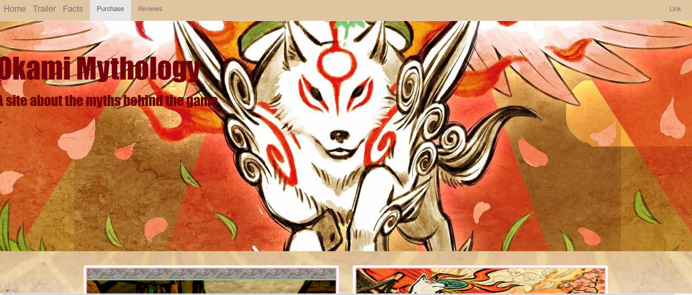

# japanese-myth-project

A second week html/css project about website design.
This project is an initial template of a website. It focuses on the video game 'Okami' and is a hypothetical fan site.
It includes a jumbotron, functional Nav bar and is responsive to both desktop and ipad screens. It has a total of three pages and includes an embedded video on the 'trailer' page.

This site was built using CSS and HTML.

An example of this can be found at: 
No installation is required and the site can be reached from this URL:https://legreen1984.github.io/japanese-myth-project/index.html

This site was built using CSS and HTML.
